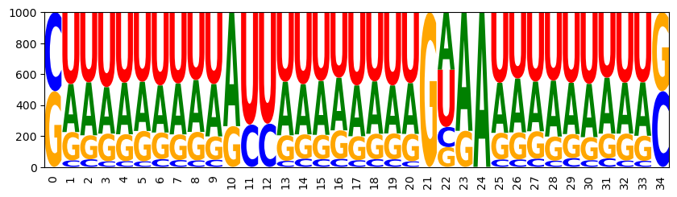
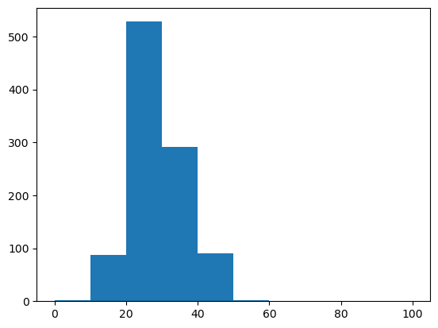
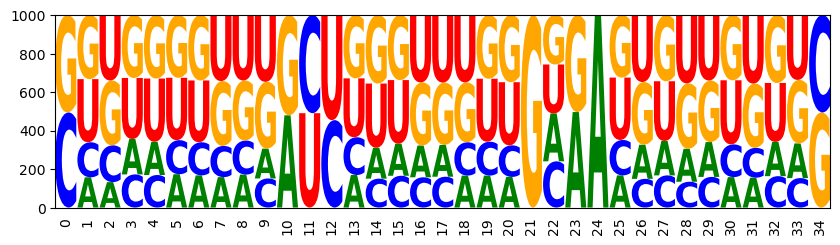
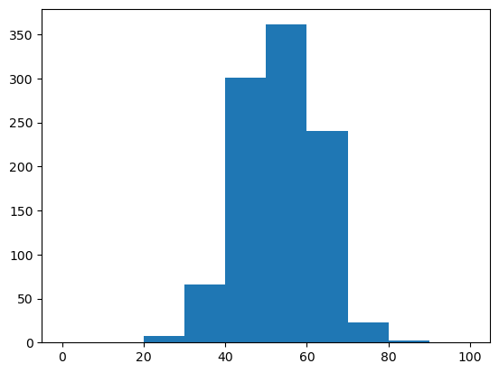
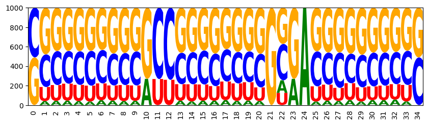
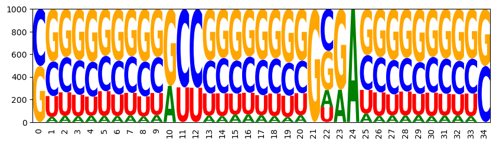
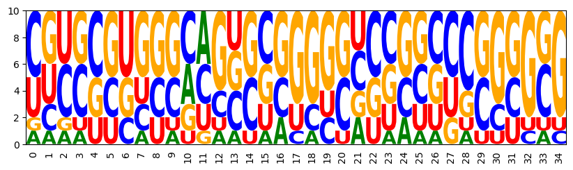
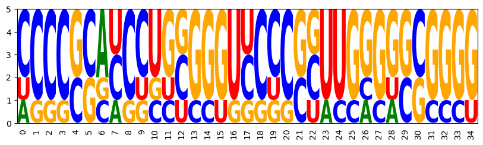
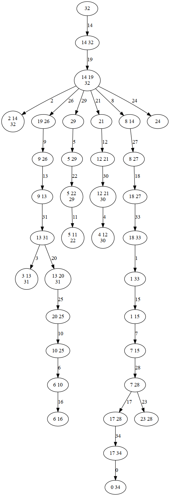
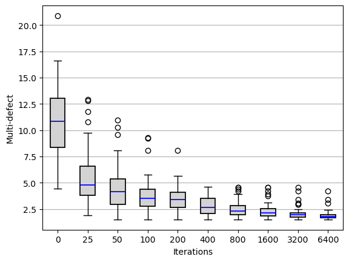

# Bookchapter Tutorial
A collection of code from the Infrared RNA design bookchapter

------------------------------------------------------------

## Online resources and software environment

​

This document is hosted online as [Jupyter notebook](https://www.lix.polytechnique.fr/~will/Software/Infrared/current/Doc/Bookchapter.ipynb) with precomputed results. Download this file to view, edit and run it in Jupyter.

​

We recommend to install all required software using Mamba (or Conda) and PIP.

```

mamba create -n infrared -c conda-forge infrared jupyter jupytext matplotlib seaborn graphviz logomaker

mamba activate infrared

# optionally install the Vienna RNA package (only Linux or MacOS)
mamba install -c conda-forge -c bioconda viennarna

pip install graphviz

mamba deactivate infrared

```

​

Start the Jupyter notebook server after activating the environment

```

mamba activate infrared

jupyter notebook

```

The [original sources](https://gitlab.inria.fr/amibio/Infrared/-/tree/master/Doc/Tutorials) are part of the Infrared distribution and hosted on Gitlab (in Jupytext light Script format).

​

------------------------------------------------------------

## Disclaimer
This notebook contains code for the examples from the bookchapter ["Developing complex RNA design applications in the Infrared framework"](https://hal-lirmm.ccsd.cnrs.fr/X-LIX/hal-03711828v2)
by Hua-Ting Yao, Yann Ponty, and Sebastian Will.

This document should be used **in parallel to the bookchapter**.


The main purpose of this notebook is to allow readers of the chapter to easily run examples and possibly experiment with the code. Code is therefore given in the same order as in the bookchapter and under corresponding section titles. In turn, the notebook contains almost no explanations, as these are given in the manuscript.

Compared to the code given in the chapter, we extended some code to make it even more illustrative, e.g. by plotting results. Finally, we provide code to generate figures of the bookchapter in the Appendix.


## 1 Introduction


```python
#[Intro]
import infrared as ir
import infrared.rna as rna
```


```python
import matplotlib.pyplot as plt
```


```python
target = "((((((((((...))))((((....))))))))))"
model = ir.Model(len(target), 4)
model.add_constraints(rna.BPComp(i, j) for (i, j) in rna.parse(target))
sampler = ir.Sampler(model)
samples = [sampler.sample() for _ in range(10)]
```


```python
sequences = [rna.ass_to_seq(x) for x in samples]
sequences
```


    ['GCAGUUGGAGCAGUUUUGCGAGGUUUCGCAACUGC',
     'CCGUGGGGCUUGAGGUUUCUCAAUGGGGAUUACGG',
     'UGGUGGUGGGCCUCCCAUUAAAUUCUUAGUUGCUA',
     'CUGUCACGUUCUCAGCGAAUAAAUAUAUUUGGUAG',
     'CGUUUGGAUUACAAGUUAAGUAAGAAUUUUAGGCG',
     'UCGAGGAAUUUGGAAUUGUAGUCUGUUAUCUUCGG',
     'AGCGUACGGCGCAGCUGCCGAGUCGUCGGUGUGCU',
     'AAGGUUGGGACCGUUCUGGGAGGAUUCCCAGCUUU',
     'GGAGGAAUGACUAUCGUGGGAUUUUUCCUUCCUUC',
     'ACGGUGACCGCUUCGGUUGUCGCUUGGCGUACUGU']


We are going to visualize the nucleotide frequencies of the sampled sequences 
if module ```logomaker``` is availabe.
(e.g. install by ```conda install logomaker```)


```python
def draw_logo(samples,name=None):
    import logomaker as lm
    
    sequences = [rna.ass_to_seq(x) for x in samples]
    
    matrix = lm.alignment_to_matrix(sequences = sequences)
    logo = lm.Logo(matrix)
    logo.style_xticks(rotation=90, fmt='%d', anchor=0)
    logo.ax.xaxis.set_ticks_position('none')
    if name is not None:
        plt.savefig(name)
    plt.show()
    logo.ax.xaxis.set_tick_params(pad=-1)
    return sequences

def opt_draw_logo(samples,name=None,num=10):
    try:
        draw_logo(samples,name)
    except ModuleNotFoundError as e:
        print(e)
    for x in samples[:num]:
        print(rna.ass_to_seq(x))
    if len(samples)>num:
        print("...")

def assignments_to_seqs(xs):
    return [rna.ass_to_seq(x) for x in xs]

opt_draw_logo(samples)
```


    

    


    GCAGUUGGAGCAGUUUUGCGAGGUUUCGCAACUGC
    CCGUGGGGCUUGAGGUUUCUCAAUGGGGAUUACGG
    UGGUGGUGGGCCUCCCAUUAAAUUCUUAGUUGCUA
    CUGUCACGUUCUCAGCGAAUAAAUAUAUUUGGUAG
    CGUUUGGAUUACAAGUUAAGUAAGAAUUUUAGGCG
    UCGAGGAAUUUGGAAUUGUAGUCUGUUAUCUUCGG
    AGCGUACGGCGCAGCUGCCGAGUCGUCGGUGUGCU
    AAGGUUGGGACCGUUCUGGGAGGAUUCCCAGCUUU
    GGAGGAAUGACUAUCGUGGGAUUUUUCCUUCCUUC
    ACGGUGACCGCUUCGGUUGUCGCUUGGCGUACUGU


### Multiple targets


```python
#[Multiple_targets]
targets = ["((((((((((...))))((((....))))))))))",
           "((((((.((((((((....))))..))))))))))",
           ".((((((...)))))).(((((((....)))))))"]
```


```python
for target in targets:
    model.add_constraints(rna.BPComp(i, j) for (i, j) in rna.parse(target))
```


```python
sampler = ir.Sampler(model)
designs = [sampler.sample() for _ in range(10)]

samples = [x for x in designs]
opt_draw_logo(samples)
```


    

    


    GGGACAUAGGAUGUCUGGAGAUGGCUCUUUGUCUC
    UUCUGAGUCCUUCGGAUUUUCGAUGGGGAUUGGGA
    UUCUGUGUCUUGCGGAUUCCUGCUUGGGAGUAGGA
    AGGAGGUGGGAUUUCCAGGGGGAAGUCCUUCUUUU
    GGGAGUUGGAAGUUUUAAGGGGUGAUUUUGUUUUU
    AAGGGUUAGAGGUUUUAAGGGGUACUUCUGUCCUU
    GAGACGUGGGGUGUUUAGAGGUAGGCUUUUGUUUC
    UUUUGGGCUCUCUGGGUCUCUGGCCAGGGUCGGAG
    GGGGUCCGAGGGGCUCGGAGGUCGCCUUCGAUUUC
    GGGACGUGGGAUGUCCAGAGACGGGUCUUCGUUUU


```python
#[Multiple_targets-bpenergy]
for target in targets:
    model.add_functions([rna.BPEnergy(i, j, False) for (i, j) in rna.parse(target)], 'energy')
```

## 3 Methods

### 3.1 Elementary use of Infrared - A simple design model


```python
#[3.1]
n = 35
```


```python
model = ir.Model(n,4)
```


```python
target = "((((((((((...))))((((....))))))))))"
model.add_constraints(rna.BPComp(i, j) for (i, j) in rna.parse(target))
```


```python
sampler = ir.Sampler(model)
```


```python
samples = [sampler.sample() for _ in range(10)]
```


```python
sequences = [rna.ass_to_seq(sample) for sample in samples]
```


```python
opt_draw_logo(samples)
```


    

    


    CUGUGGGGAGUAUCUCUGCGCCGUAGCGCUCGCGG
    UGGGGUUAGUGUUGCUAUCUGGUACCGGGGCUCCA
    UGGGGUUCAUAGGAUGAUCAAAUAAUUGGGUUCUA
    CUAAUUCGAUCCGAUCGACGAAGGCUCGUGAUUAG
    UUUGGGGAGUUAAACUUUUUGGUUGUGGGUCCAGG
    GGUGGUGCGGAGAUUGCGACUAGUGAGUUACCGCU
    CGGGAGCUAUUGGAUAGACUGUUAUUAGUUUUUCG
    UAAUAAGUCCAGCGGGCGCGGACACUCGUUUGUUA
    UUGCCCUGGUUGCGUCAUUCCCCAAGGGGGGGUGA
    UUCAUGGUAUUACAUGCUCGAAUCGUUGGUGUGAA


### 3.2 Sequence constraints in IUPAC code


```python
#[3.2]
iupac_sequence = "SNNNNNNNNNRYYNNNNNNNNGNRANNNNNNNNNS"
```


```python
for i, x in enumerate(iupac_sequence):
    model.add_constraints(ir.ValueIn(i, rna.iupacvalues(x)))
```


```python
sampler = ir.Sampler(model)
```


```python
samples = [sampler.sample() for _ in range(20)]

opt_draw_logo(samples)
```


    

    


    CUACAUUCCGGUCCGGAUUUUGGGAGGGAAUGUGG
    CUCUAGUGUGAUUCGCAGUGCGAGAGCGUCUAGAG
    CGUUGUAUUUAUCGGGUCUUUGUAAGGAGGUGGCG
    CGGGUGGGGGACCCCCUACGAGUAAUCGUCAUUCG
    CGGGGUUGCUGUUAGUACAAGGCGAUUUGAUUCUG
    GUGGUGAGUGAUCUACUUAACGAGAGUUGUGCCGC
    GGACCUUUAAGCUUUAAGUUAGCAAUGACGGGUCC
    GUUAGUUUAGACCUUGAUAUAGGGAUGUGGCUGAC
    GAGGCUGACUAUUAGUCAACUGGGAGGUUAGCCUC
    GAUCAUUUCUACUAGAAGGAUGUGAGUUUGUGAUC
    ...


### 3.3 Control of GC content

add functions for GC control:


```python
#[3.3]
model.add_functions([rna.GCCont(i) for i in range(n)], 'gc')
```

set a weight and sample


```python
model.set_feature_weight(1, 'gc')
sampler = ir.Sampler(model)
samples = [sampler.sample() for _ in range(1000)]
```


```python
opt_draw_logo(samples)
```


    

    


    CUGGGCGAGCGUCGCUCUAGGGGGACCUGGCCCAG
    GGCCGGGGGUGCCGUCCGGCCGGGAGGCCCCGGUC
    GGUUUGUCGGAUCUCGGGUCGGCGAUGACCAGGCC
    CGGUGCGAUUGCUGGUCUGCUGGAAAGCGGCGCCG
    GGACCCCCGCGCCGUGGCCUUGCGAGAGGGGGUUC
    CCCGCCCGGAGUCUCUGUCCCGGGAGGGGGGCGGG
    CGCCGCUUCGGCUCGGGGAGGGUAACCUCGUGGCG
    CGCCGGCCCGGCUUGGGCGGCGGAAGCCGCCGGCG
    GCGGGGGUGUGCUACACCCCAGAGAUGGGCCCCGC
    CGCCGGCCGGACUUUGGGGGGGCGACCCCUCGGUG
    ...


```python
## Code to produce the figures in the paper
WRITEFIGS = False
for name,weight in [('minus', -1), ('zero', 0), ('plus', 1)]:
    
    model.set_feature_weight(weight, 'gc')
    sampler = ir.Sampler(model)
    samples = [sampler.sample() for _ in range(1000)]

    opt_draw_logo(samples, f"gc_content_{name}-logo.svg")
    sequences = assignments_to_seqs(samples)

    gc_contents = [100*sum(x in "GC" for x in sequence)/len(sequence) for sequence in sequences]
    h = plt.hist(gc_contents,bins=10,range=(0,100))
    if WRITEFIGS:
        plt.savefig(f"gc_content_{name}-hist.svg")
```


    

    


    CAUAAUUUUUGUUAAAAGUGAGGAAUUACAUUAUG
    GUAAUUUGAUACUGUUGAUAUGUGAAUAUAAUUGC
    CUUCUUUAUUAUCAAUGUAUAGAAAUAUAAAGGAG
    GGUAGAUAUAGUCUGUAAUAUGAAAAUAUUCUAUC
    GUUUAUUCGAAUUUUGGAAUUGAAAAAUUGUAGAC
    CUCAGUAAGAAUUUUUUUUUUGUAAAAAAAUUGAG
    CUUCUAGUAUAUCAUAUUAUAGGAAUGUAUAGAGG
    CUUAAAAUAUAUUAUAUAGUUGGAAGAUUUUUGAG
    CUUUUAAUUAAUUUAAUUAUUGUAAAAUAUAAAAG
    CUUUUGUUUUGUUAAGGAAAUGUAAAUUUCGAAAG
    ...


    

    


    

    


    GCUAGAUGGUGCCACUGGAGUGAAAGCUUUCUGGC
    CACAGAAGUUGCCAGUUUCCGGUGAUGGAUCUGUG
    CAGUGACUCGACCUGGGGACGGCAAUGUUUUACUG
    CUCAACUCAGAUCCUGAUUAGGAAACUAAGUUGGG
    CUGCUUGGACGUCGUUUUCUCGGGAGAGGAGGUAG
    GAAUAGGCGGACUUUGCUGCCGUAAGGCGUUAUUC
    GUUUCGGUGGAUCCUGUAAAGGAGAUUUUCGGAAC
    CGGCUUGGGUGUCGUUUGAGUGGAAAUUCAGGUUG
    GGGACUGGGGACCCUUUUUGCGAGAGUAAAGUCUC
    GGUGACCGUUACCAACGGCCGGCGAUGGUGUUGCC
    ...


    

    


    

    


    GCAUAUCGCGACCCGCGCGUGGGGACACGAUGUGC
    GGCAUAGCGCGCCGUGCUGCCGCAAGGUGUAUGCC
    CGGCGCGUCGACCCGACCUGCGGAAGCGGGCGCCG
    CGCGCUGGGGGCCCUCCCCGAGGGAUCGGAGCGCG
    CUGGUGGGUGGUCCACUUGGCGUGAGCCGCGCCGG
    CGGGGGCCGGGCCCCGGCGCCGUGAGGUGCUUCCG
    CCGGGGGGCCGCCGGCCGGGUGUGAGCCCCCCCGG
    CGCGCCGCGGGCUCCGCUCGCGAGAGCGAGGUGCG
    GGUGCGCGGGGUCCCCGGCCGGAGAUGGCUGUACC
    GCCGUGGGGGACCUCCCGUGCGCGAGCACUGUGGC
    ...


    

    


Set a target of 75% GC content and then draw targeted samples


```python
#[3.3.3]
sampler = ir.Sampler(model)
sampler.set_target( 0.75 * n, 0.01 * n, 'gc' )
samples = [sampler.targeted_sample() for _ in range(1000)]
```


```python
opt_draw_logo(samples)
sequences = assignments_to_seqs(samples)

gc_contents = [100*sum(x in "GC" for x in sequence)/len(sequence) for sequence in sequences]
gc_content = sum(gc_contents) / len(gc_contents)
print(f"GC content in samples: {gc_content:0.2f}%")
```


    

    


    CCCAGGGGGGACCCUCCGUCGGCGACGACUUUGGG
    GCGGGCGUGGAUCCCGCCCGUGCGAAUGGGCUUGC
    GGUUCCAACUGCUGGUUGCGGGGGACCGCGGGGCC
    GCCAGUCGGGACCUCCGGGGGGCAAUUCCGCUGGC
    GGCGUUGGGGGUCUUUCCCGUGCGAGCGGGGCGUC
    GGGGCGCCGUACUGCGGGUUGGCAACGGUCGCUCC
    CCGGACUUGGAUCUCGACCGGGGGACCGGGUCCGG
    GCCGCGCUAUGCCGUGGGUGCGCAAGUGUCGCGGC
    GGGGUCCUUAGCUUAGGCCCUGGGAGGGGGGCCCC
    GCUUCGGGUCGCUGACCGCACGCAAGUGCCGGGGC
    ...
    GC content in samples: 74.29%


### 3.4 Controlling energy - Multiple features


```python
#[3.4]
model = ir.Model(n,4)
bps = rna.parse(target)
model.add_constraints(rna.BPComp(i, j) for (i, j) in bps)
model.add_functions([rna.GCCont(i) for i in range(n)], 'gc')
```

add (base pair) energy control


```python
model.add_functions([rna.BPEnergy(i, j, (i-1, j+1) not in bps)
                     for (i, j) in bps], 'energy')
```

target specific GC and low energy


```python
model.set_feature_weight(-2, 'energy')
sampler = ir.Sampler(model)
sampler.set_target(0.75*n, 0.01*n, 'gc')
samples = [sampler.targeted_sample() for _ in range(10)]
```


```python
opt_draw_logo(samples)
```


    

    


    CCGGGCUCCGAGUCGGGCUGGCUAUCCAGGCCUGG
    GCCGGGCGCUCUAGGCGCCUCGACUGAGGUUCGGC
    CCGGGGCGUGAACCGCGUCCUUCCAGGGACUCCGG
    GCGGCCACCCCGUGGGUGGGUUAACAUCCGGCCGC
    CCGGGCCGGGCAAUCCGUGCCAGAAGGCAGCCUGG
    AGCGCACCACUCGGUGGGGGCCGCCGCUCUGUGCU
    AGGUGCUGCGGCUCGCACGGCACCAGCCGGCGCUU
    GCGCUAGCGCCUAGCGCCGCGAAUCCGCGUAGCGC
    CCGGGGGGCCAUGGGCCCCUAUUGAUAGGCCCCGG
    UUCGGCGAGGCUACUUCGCCUGAGGGGGCGCCGGG


add stacking energy control - this could be used in place of defining base pair energyin the code above


```python
#[stackenergy]
model.add_functions([rna.StackEnergy(i, j)
    for (i,j) in bps if (i+1,j-1) in bps], 'energy')
```

### 3.5 Targeting Turner energy - Customized features

*Note:* From this point on, we require RNA energy evaluation based on the Vienna RNA library. Under Mac and Linux, the functionality is accessed via module RNA of the library. Since, this is typically unavailable on Windows, we provide a work around.


```python
#[3.5]
try:
    from RNA import energy_of_struct
except:
    print("*Warning*: the RNA Python bindings cannot be imported.\n\n"
          "For Linux and MaxOS it is recommened to install viennarna via conda. "
          "Windows users are asked to install the Vienna package using the provided Windows installer "
          "and make sure that the command line tool RNAeval is found based on their search path."
         )
    def energy_of_struct(seq,struct):
        try:
            import subprocess
            import re
            p = subprocess.run(["RNAeval"], input=f"{seq}\n{struct}".encode('utf-8'), capture_output=True)
            m = re.search(r'([0-9-.]*)\)$',p.stdout.decode('utf-8').split('\n')[1])
            res = float(m[1])
        except Exception as e:
            print(f"Cannot evaluate energy of {seq}, {struct}")
            raise e
        return res
```


```python
# Restate current model
model = ir.Model(n,4) 
bps = rna.parse(target)
model.add_constraints(rna.BPComp(i, j) for (i, j) in bps)
model.add_functions([rna.GCCont(i) for i in range(n)], 'gc')
model.add_functions([rna.BPEnergy(i, j, (i-1, j+1) not in bps)
                     for (i, j) in bps], 'energy')
```

add the Turner energy feature


```python
model.add_feature('Energy', 'energy',
    lambda sample, target=target:
        energy_of_struct(rna.ass_to_seq(sample), target))
```

specify targets and draw targeted samples


```python
sampler = ir.Sampler(model)
sampler.set_target(0.75*n, 0.05*n, 'gc')
sampler.set_target(-10, 0.5, 'Energy')
samples = [sampler.targeted_sample() for _ in range(10)]
```


```python
opt_draw_logo(samples)
sequences = assignments_to_seqs(samples)

[(seq,energy_of_struct(seq, target)) for seq in sequences]
```


    

    


    CUACGUGCGGAAGCCGCGCGCUGCAGCGCGUGUGG
    GGCCGCUUGGUGGUCAGUGGGGGUCCCUGGCGGCC
    CGCCUGCGCUGACAGUGGCUGCUCGCAGCUGGGCG
    CCUGCGUGGCCCGGCCAGAUCUCGGGGUUCGCGGG
    CCGGCUUGGCCUGGCCGGGGGAUGGUUUCGGCCGG
    UGUGCCUACAGAUUGUGCGCCGCCGGGCGGGUGCG
    AUCUGGGUGGCCCCUGCGGGUCCUCACCCCCGGAU
    UUUGUCCGUGCAGCGCGGGGCUCCAGCCCGGCGGG
    CAUCCGUGCGACAUGCAGGCGACGGUGCCCGGGUG
    UGCACGGCUCAUGGGGCUGGGCGACCUCACGUGCG


    [('CUACGUGCGGAAGCCGCGCGCUGCAGCGCGUGUGG', -10.399999618530273),
     ('GGCCGCUUGGUGGUCAGUGGGGGUCCCUGGCGGCC', -10.100000381469727),
     ('CGCCUGCGCUGACAGUGGCUGCUCGCAGCUGGGCG', -10.100000381469727),
     ('CCUGCGUGGCCCGGCCAGAUCUCGGGGUUCGCGGG', -10.199999809265137),
     ('CCGGCUUGGCCUGGCCGGGGGAUGGUUUCGGCCGG', -10.0),
     ('UGUGCCUACAGAUUGUGCGCCGCCGGGCGGGUGCG', -10.199999809265137),
     ('AUCUGGGUGGCCCCUGCGGGUCCUCACCCCCGGAU', -9.600000381469727),
     ('UUUGUCCGUGCAGCGCGGGGCUCCAGCCCGGCGGG', -9.800000190734863),
     ('CAUCCGUGCGACAUGCAGGCGACGGUGCCCGGGUG', -10.199999809265137),
     ('UGCACGGCUCAUGGGGCUGGGCGACCUCACGUGCG', -9.600000381469727)]


### 3.6 Multiple target targets


```python
#[3.6]
model = ir.Model(n,4) 
model.add_functions([rna.GCCont(i) for i in range(n)], 'gc')
for k, target in enumerate(targets):
    bps = rna.parse(target)
    model.add_constraints(rna.BPComp(i, j) for (i, j) in bps)
    model.add_functions([rna.BPEnergy(i, j, (i-1, j+1) not in bps)
                         for (i, j) in bps], f'energy{k}')
```

#### Target specific GC content and high affinity to all targets


```python
# set weights for energy targets
for k,_ in enumerate(targets):
    model.set_feature_weight(-2, f'energy{k}')

# create sampler and set target
sampler = ir.Sampler(model)
sampler.set_target(0.75*n, 0.05*n, 'gc')
samples = [sampler.targeted_sample() for _ in range(5)]

opt_draw_logo(samples)
sequences = assignments_to_seqs(samples)

# annotate sequences with energies (annotate with Turner energies only if RNA module is available)
try:
    import RNA
    sequences = ["".join([seq]+[f" {energy_of_struct(seq, target):5.1f}" for target in targets]) for seq in sequences]
except ModuleNotFoundError:
    pass

sequences
```


    

    


    AGGGGCCAGGGGUCCUGGGGGGCACCCCUGCCCCU
    CCCCGGGCCUCUCGGGUCCUCGGUUGAGGCCGGGG
    CCCCCCAUCCUGGGGGUUCCCCCUUGGGGGGGGGG
    UCCCGCACCCUGCGGGUCCCCGUUUGGGGGCGGGG
    CCCCCGAUCCUCGGGGUUCCCCGUUGGGACGGGGG


    ['AGGGGCCAGGGGUCCUGGGGGGCACCCCUGCCCCU -17.6 -21.8 -19.3',
     'CCCCGGGCCUCUCGGGUCCUCGGUUGAGGCCGGGG -16.8 -20.0 -18.0',
     'CCCCCCAUCCUGGGGGUUCCCCCUUGGGGGGGGGG -16.0 -24.2 -21.5',
     'UCCCGCACCCUGCGGGUCCCCGUUUGGGGGCGGGG -19.0 -21.9 -19.3',
     'CCCCCGAUCCUCGGGGUUCCCCGUUGGGACGGGGG -15.5 -23.4 -20.1']


#### Target specific GC content and specific Turner energies for all targets

add Turner energy features for all target targets


```python
#[add-multi-energy-features]
for k, target in enumerate(targets):
    model.add_feature(f'Energy{k}', f'energy{k}',
        lambda sample, target=target:
            energy_of_struct(rna.ass_to_seq(sample), target))
sampler = ir.Sampler(model)
sampler.set_target(0.75*n, 0.01*n, 'gc')
sampler.set_target( -15, 1, 'Energy0')
sampler.set_target( -20, 1, 'Energy1')
sampler.set_target( -20, 1, 'Energy2')
```


```python
samples = [sampler.targeted_sample() for _ in range(5)]
```


```python
opt_draw_logo(samples)
sequences = assignments_to_seqs(samples)

# annotate sequences with energies
["".join([seq]+[f" {energy_of_struct(seq, target):5.1f}" for target in targets]) for seq in sequences]
```


    

    


    AGGGCCUGGGAGGCCCGAGGGUCGAUCCUGGCCCU
    CCCCCAGCUCCUGGGGUCCCCUAUAGGGGUGGGGG
    AGGGGCUGGAGGCUCUAGGGGGCGACUCCGCCCCU
    GGGGCUUGGGGAGCCCAGGGGCUAGCUCUAGCCCC
    UCCUCCACCCUGGGGGUCCCUCCCAAGGGGGAGGG


    ['AGGGCCUGGGAGGCCCGAGGGUCGAUCCUGGCCCU -14.7 -20.8 -19.8',
     'CCCCCAGCUCCUGGGGUCCCCUAUAGGGGUGGGGG -15.9 -19.6 -19.2',
     'AGGGGCUGGAGGCUCUAGGGGGCGACUCCGCCCCU -15.0 -20.9 -19.3',
     'GGGGCUUGGGGAGCCCAGGGGCUAGCUCUAGCCCC -14.3 -19.2 -20.7',
     'UCCUCCACCCUGGGGGUCCCUCCCAAGGGGGAGGG -15.2 -19.8 -20.7']


### Plot dependencies and tree decomposition


```python
from IPython.display import Image
import re
```


```python
# Plot dependency graph

filename = 'dependency_graph.dot'
model.write_graph(filename, True)

ir.dotfile_to_png(filename)
ir.dotfile_to_pdf(filename)

filename = re.sub(r"dot$","png",filename)

Image(filename=filename,width=600)
```


    

    


```python
# Plot tree decomposition
sampler = ir.Sampler(model)
print(f"Tree width: {sampler.treewidth()}")
filename="treedecomp"
sampler.plot_td(filename,'png')
sampler.plot_td(filename,'pdf')
sampler.plot_td(filename+".dot",'dot')
Image(filename=filename+".png",width=300)
```

    Tree width: 2


    

    


### 3.7 Negative design by sampling


```python
#[3.7]
import RNA
```


```python
target = targets[0]
n = len(target)
```


```python
def is_mfe_design(sequence, target):
    fc = RNA.fold_compound(sequence)
    return fc.eval_structure(target) == fc.mfe()[1]
```


```python
def single_target_design_model(target):
    n, bps = len(target), rna.parse(target)
    model = ir.Model(n, 4)
    model.add_constraints(rna.BPComp(i, j) for (i, j) in bps)
    model.add_functions([rna.GCCont(i) for i in range(n)], 'gc')
    model.add_functions([rna.BPEnergy(i, j, (i-1, j+1) not in bps)
        for (i, j) in bps], 'energy')
    model.set_feature_weight(-1.5, 'energy')
    return model
```

solve by direct sampling


```python
sampler = ir.Sampler(single_target_design_model(target))
sampler.set_target(0.7 * n, 0.1 * n, 'gc')
for i in range(50):
    seq = rna.ass_to_seq(sampler.targeted_sample())
    if is_mfe_design(seq, target):
        print(f"{i} {seq}")
```

    2 CUGAGGCGCCUAUGGCGGGGGCCGACCCCCCUCAG
    3 GGUCGGAGGGGCCCCCUGAGCUACCGCUCCCGACC
    6 GGGCGGAGGCAGGGCCUUCCCUAUCGGGGCCGCCU
    7 GGGGGCGGGCUUAGCCCUCGUUAAAGCGAGCCCCC
    13 CGCGGCCCGAUGUUCGGGAGCCGCUGCUCGCCGCG
    17 CACCGGCCCCAAGGGGGGACGGACCCGUCCCGGUG
    18 CCCUGGCCGCUAUGCGGGCGGAAUUCUGCCCAGGG
    26 GGGUGGGUCCAAGGGACGCGGCAAACCGCCCACCC
    28 GCGGCUAGAGUUACUCUCCGGCAUUCCGGGGCCGC
    37 GGCCCUGCGGUUGCCGCCCCCCAAAGGGGAGGGCC
    38 UCCUGCGCGCCGUGCGUCGAUGCCCAUCGGCGGGA
    40 CGAACCCCCCUACGGGGGCGCCAGUGCGCGGUUCG
    42 GCGGGGUCCGGGACGGAUGGGAGCACUCACCCCGC
    46 CCCCGCGGUGUAACGCCGCCUACGCAGGUGCGGGG


```python
def target_frequency(sequence, target):
    fc = RNA.fold_compound(sequence)
    fc.pf()
    return fc.pr_structure(target)
```


```python
sampler = ir.Sampler(single_target_design_model(target))
sampler.set_target(0.7 * n, 0.1 * n, 'gc')
best = 0
for i in range(100):
    seq = rna.ass_to_seq(sampler.targeted_sample())
    freq = target_frequency(seq, target)
    if freq > best:
        best = freq
        print(f"{i} {seq} {freq:.6f}")
```

    0 CGUGCGCCCCACAGGGGGGGGAUUACCCCCGUGCG 0.114687
    5 GCCGUACGCCAUUGGCGGGGAAGUUUCUCUGCGGC 0.568546
    8 GCACCCGGCCGUUGGCCGGUCGAUAGACCGGGUGC 0.929765


### 3.8 Larger single-target designs by constraint generation

RNAPOND-like negative design (generating constraints for disruptive base pairs).


```python
#[3.8]
from collections import Counter

## A hard instance, eterna37
# target = "(((((.((((((.((((((.((((((.((((((.((((((....((((((......)))))).)))))).(((((...(((((((...)))))))))))).)))))).((((((((((((...)))))))...))))).))))))....))))))....))))))....)))))"

## a slightly harder instance
target = "..(((..((((.....)))).((...(((.....)))...))...))).."

n = len(target)
bps = rna.parse(target)
```


```python
def cg_design_iteration():
    model = single_target_design_model(target)
    model.add_constraints(rna.NotBPComp(i, j) for (i, j) in dbps)
    sampler = ir.Sampler(model, lazy=True)
    if sampler.treewidth() > 10 or not sampler.is_consistent():
        return "Not found"
    ctr = Counter()
    found, sol = False, None
    for i in range(100):
        seq = rna.ass_to_seq(sampler.targeted_sample())
        fc = RNA.fold_compound(seq)
        mfe, mfe_e = fc.mfe()
        if fc.eval_structure(target) == mfe_e:
            sol = seq
        ctr.update(rna.parse(mfe))
    ndbps = [x[0] for x in ctr.most_common() if x[0] not in bps]
    dbps.extend(ndbps[:2])
    return sol
dbps, seq = [], None
while seq is None:
    seq = cg_design_iteration()
print(seq)
```

    UACCACCGGGGCAAAUCCCCAUCGUAGGCAACAAGCUAUAGACCAUGGAG


### 3.9 Negative design by stochastic optimization with partial resampling

Define multi-target design model for resampling of subsets 


```python
#[3.9]
import RNA
targets = ["((((((((((...))))((((....))))))))))",
           "((((((.((((((((....))))..))))))))))",
           ".((((((...)))))).(((((((....)))))))"]
```


```python
#[multi-defect]
def multi_defect(sequence, targets, xi=1):
    k = len(targets)
    fc = RNA.fold_compound(sequence)
    ee = fc.pf()[1]
    eos = [fc.eval_structure(target) for target in targets]
    diff_ee = sum(1/k * (eos[i] - ee) for i in range(k))
    diff_targets = sum(2/(k*(k-1)) * abs(eos[i]-eos[j])
        for i in range(k) for j in range(k) if i<j)
    return diff_ee + xi * diff_targets
```


```python
import random
import math
```

Optimize an ojective function by a Monte-Carlo optimization strategy with model resampling


```python
#[mc-optimize]
def mc_optimize(model, objective, steps, temp, start=None):
    sampler = ir.Sampler(model)
    cur = sampler.sample() if start is None else start
    curval = objective(cur)
    best, bestval = cur, curval
    
    ccs = model.connected_components()
    weights = [1/len(cc) for cc in ccs]
    
    for i in range(steps):
        cc = random.choices(ccs,weights)[0]
        new = sampler.resample(cc, cur)
        newval = objective(new)
        if (newval >= curval
            or random.random() <= math.exp((newval-curval)/temp)):
            cur, curval = new, newval
            if curval > bestval:
                best, bestval = cur, curval

    return (best, bestval)
```


```python
#[mc-multi-design-model]
n = len(targets[0])
model = ir.Model(n, 4)
model.add_functions([rna.GCCont(i) for i in range(n)], 'gc')
for target in targets:
    ss = rna.parse(target)
    model.add_constraints(rna.BPComp(i, j) for (i, j) in ss)
    model.add_functions([rna.BPEnergy(i, j, (i-1, j+1) not in ss)
        for (i, j) in ss], 'energy')
model.set_feature_weight(-0.8, 'energy')
model.set_feature_weight(-0.3, 'gc')
```


```python
best, best_val = mc_optimize(model,
    lambda x: - multi_defect(rna.ass_to_seq(x),targets,1),
    1000, 0.01)

print(rna.ass_to_seq(best), - best_val)
```

    GGGGUGCGGGGUACCCGGGGGUAGUCCCCUACCCC 2.445469538370768


### 3.10 A real world example: design of a Tandem-Riboswitch


```python
#[3.10]
seqTheo0 = "AAGUGAUACCAGCAUCGUCUUGAUGCCCUUGGCAGCACUUCAGAAAUCUC"\
           "UGAAGUGCUGUUUUUUUU"
seqTet0  = "GGCCUAAAACAUACCAGAGAAAUCUGGAGAGGUGAAGAAUACGACCACCU"\
           "AGGCCGACAGUGGCCUAGGUGGUCGUUUUUUUUU"
```


```python
seqTheo  = "NNNNGAUACCAGCAUCGUCUUGAUGCCCUUGGCAGCNNNNNNNNNNNNNN"\
           "NNNNNNNNNNUUUUUUUU"
aptTheo  = "(((((...((((((((.....)))))...)))...))))).........."\
           ".................."
termTheo = "...............................(((((((((((((....))"\
           ")))))))))))......."


seqTet   = "NNNNNAAAACAUACCAGAGAAAUCUGGAGAGGUGAAGAAUACGACCACCU"\
           "ANNNNNNNNNNNNNNNNNNNNNNNNUUUUUUUUU"
termTet  = "........................................(((((((((("\
           "(((((......)))))))))))))))........"
aptTet   = "((((((.......(((((....)))))...((((...........)))))"\
           ")))))............................."
```


```python
spacerLen = 30
aptamers    = aptTheo  + "."*spacerLen + aptTet
terminators = termTheo + "."*spacerLen + termTet
sequence    = seqTheo  + "N"*spacerLen + seqTet
```


```python
n = len(aptTheo) + spacerLen + len(aptTet)
variants = dict(
    empty = '.'*n,
    aptTheo = aptTheo + '.'*(n-len(aptTheo)),
    aptTet = '.'*(n-len(aptTet)) + aptTet,
    termTheo = termTheo + '.'*(n-len(aptTheo)),
    termTet = '.'*(n-len(aptTet)) + termTet,
    spacer = '.'*len(aptTheo) + 'x'*spacerLen + '.'*len(aptTet)
)
```


```python
def constrained_efe(sequence,c):
    fc = RNA.fold_compound(sequence)
    fc.hc_add_from_db(c)
    return fc.pf()[1]

def rstd_objective(sequence):
    efe = {k:constrained_efe(sequence,variants[k]) 
           for k in variants}
        
    term_stability = efe['termTheo'] + efe['termTet'] \
        - 2*efe['empty']
    apt_target = abs(efe['aptTheo']-efe['empty']-7) \
        + abs(efe['aptTet']-efe['empty']-10)
    spacer_unfolding = efe['spacer']-efe['empty']

    return term_stability + apt_target + spacer_unfolding
```


```python
rstd_targets = [aptamers, terminators]
n = len(rstd_targets[0])
model = ir.Model(n, 4)

for i, x in enumerate(sequence):
    model.add_constraints(ir.ValueIn(i, rna.iupacvalues(x)))

model.add_functions([rna.GCCont(i) for i in range(n)], 'gc')

for k,target in enumerate(rstd_targets):
    ss = rna.parse(target)
    model.add_constraints(rna.BPComp(i, j) for (i, j) in ss)
    model.add_functions([rna.BPEnergy(i, j, (i-1, j+1) not in ss)
        for (i, j) in ss], f'energy{k}')
model.set_feature_weight(-0.6, 'energy0')
model.set_feature_weight(-1, 'energy1')
model.set_feature_weight(-0.3, 'gc')
```


```python
#[rstd-optimize-call]
objective = lambda x: -rstd_objective(rna.ass_to_seq(x))
best, best_val = ir.mc_optimize(model, objective,
                                steps = 500, temp = 0.03)
print(rna.ass_to_seq(best), -best_val)
```

    CGAGGAUACCAGCAUCGUCUUGAUGCCCUUGGCAGCCUUGCCACUUAUGUGGCGAGGUUGUUUUUUUUAAUAUAUCAGAGCUUUUUUUUAAUAAUCGCAGCCUAAAACAUACCAGAGAAAUCUGGAGAGGUGAAGAAUACGACCACCUAGGUUGGAAAGGGCCUGGGUGGUUGUUUUUUUUU 1.2818794250488281


#### Run optimzation in parallel


```python
import concurrent.futures

steps = 500
jobs = 12

def my_rstd_optimize(i):
    random.seed(None)
    objective = lambda x: -rstd_objective(rna.ass_to_seq(x))
    best,best_val = mc_optimize(model, objective, steps = steps, temp = 0.03)
    return rna.ass_to_seq(best), -best_val

with concurrent.futures.ProcessPoolExecutor() as executor:
    res = executor.map(my_rstd_optimize, range(jobs))
res = list(res)
```


```python
for seq, val in res:
    print(f"{seq} {val:.2f}")
    fc = RNA.fold_compound(seq)
    for k,c in variants.items():
        print(f"{k:20} {fc.eval_structure(c):8.2f} {constrained_efe(seq,c):8.2f} {constrained_efe(seq,c)-constrained_efe(seq,variants['empty']):8.2f}")
```

    GUUUGAUACCAGCAUCGUCUUGAUGCCCUUGGCAGCGGGCGUGGAACUCCGCGUCCGUUGUUUUUUUUGAUGACCGCAAUAAUCCUCAUACGUAGCAACGGGUAAAACAUACCAGAGAAAUCUGGAGAGGUGAAGAAUACGACCACCUACCUGCUGGUACGGGUAGGUGGUCGUUUUUUUUU 3.91
    empty                    0.00   -76.32     0.00
    aptTheo                -11.90   -69.34     6.98
    aptTet                 -15.40   -66.46     9.87
    termTheo               -23.10   -76.31     0.01
    termTet                -28.20   -76.32     0.00
    spacer                   0.00   -72.58     3.74
    GUUUGAUACCAGCAUCGUCUUGAUGCCCUUGGCAGCGGGCGCAGUCCCCUGCGUCCGUUGUUUUUUUUGUCAGCAUAGUAAGUAAAAUAAUGUAAUCGCGGGUAAAACAUACCAGAGAAAUCUGGAGAGGUGAAGAAUACGACCACCUACCCGCGUUUACGGGUGGGUGGUUGUUUUUUUUU 4.30
    empty                    0.00   -74.90     0.00
    aptTheo                -11.90   -67.57     7.33
    aptTet                 -17.60   -63.58    11.32
    termTheo               -23.00   -74.87     0.03
    termTet                -28.00   -74.90     0.00
    spacer                   0.00   -72.29     2.61
    GUUCGAUACCAGCAUCGUCUUGAUGCCCUUGGCAGCGGGCGUCGGCAACGACGUCCGUUGUUUUUUUUUUGGACAACGAUACUUAAAUACGGAAAUGGCGGGUAAAACAUACCAGAGAAAUCUGGAGAGGUGAAGAAUACGACCACCUACCUGCGAGUACGGGUAGGUGGUCGUUUUUUUUU 3.97
    empty                    0.00   -76.22     0.00
    aptTheo                -13.90   -69.66     6.57
    aptTet                 -15.40   -66.17    10.06
    termTheo               -23.90   -76.16     0.07
    termTet                -28.20   -76.22     0.00
    spacer                   0.00   -72.81     3.41
    GUUCGAUACCAGCAUCGUCUUGAUGCCCUUGGCAGCGGGCGCACAACCGUGCGUCCGUUGUUUUUUUUCUUGACAGCGCGCUUGAAAUACGGUAAUUACUGGUAAAACAUACCAGAGAAAUCUGGAGAGGUGAAGAAUACGACCACCUACCGGCAAUUACUGGUAGGUGGUUGUUUUUUUUU 3.90
    empty                    0.00   -75.42     0.00
    aptTheo                -13.90   -68.35     7.06
    aptTet                 -15.40   -65.48     9.94
    termTheo               -23.60   -75.40     0.02
    termTet                -26.10   -75.42     0.00
    spacer                   0.00   -71.67     3.75
    GUUUGAUACCAGCAUCGUCUUGAUGCCCUUGGCAGCGGACCGUUUGCAAACGGUCCGCUGUUUUUUUUAUAUAAUUUAAAUAACCGCGGAAAGUCUCAUUUGUAAAACAUACCAGAGAAAUCUGGAGAGGUGAAGAAUACGACCACCUACGGGUGCUAUUCUGUGGGUGGUUGUUUUUUUUU 3.21
    empty                    0.00   -70.64     0.00
    aptTheo                -11.50   -63.07     7.57
    aptTet                 -10.00   -60.69     9.95
    termTheo               -24.00   -70.59     0.05
    termTet                -23.90   -70.63     0.00
    spacer                   0.00   -68.10     2.54
    GGUUGAUACCAGCAUCGUCUUGAUGCCCUUGGCAGCGGCCCGCCCUUAGGCGGGCUGCUGUUUUUUUUAAUAUAUUCAUACUAAACGCAACUAGCACUCGCUUAAAACAUACCAGAGAAAUCUGGAGAGGUGAAGAAUACGACCACCUAAGCGAGAGGGCGCUUAGGUGGUUGUUUUUUUUU 3.35
    empty                    0.00   -78.81     0.00
    aptTheo                -13.80   -71.58     7.23
    aptTet                 -15.60   -68.97     9.84
    termTheo               -28.30   -78.79     0.02
    termTet                -26.10   -78.80     0.00
    spacer                   0.00   -75.86     2.94
    GGAAGAUACCAGCAUCGUCUUGAUGCCCUUGGCAGCUUCCGUAGAAAGCUGCGGAGGCUGUUUUUUUUACACGAAUACAUGACUUUUAUUGACCUAACGCGCUAAAACAUACCAGAGAAAUCUGGAGAGGUGAAGAAUACGACCACCUAGUGCGGCUAGGUACUAGGUGGUCGUUUUUUUUU 2.11
    empty                    0.00   -72.60     0.00
    aptTheo                -15.70   -65.60     7.00
    aptTet                 -16.20   -62.70     9.90
    termTheo               -22.40   -72.56     0.04
    termTet                -28.30   -72.60     0.00
    spacer                   0.00   -70.63     1.97
    CCGUGAUACCAGCAUCGUCUUGAUGCCCUUGGCAGCGCGGGUGCGAUGGCAUUCGCGCUGUUUUUUUUCACAAACAAUUAUUGCUAAUCUGGAUACAAGGCGUAAAACAUACCAGAGAAAUCUGGAGAGGUGAAGAAUACGACCACCUACGCCCAGAAUGGCGUAGGUGGUUGUUUUUUUUU 5.06
    empty                    0.00   -76.41     0.00
    aptTheo                -16.20   -69.48     6.93
    aptTet                 -17.60   -65.93    10.48
    termTheo               -24.20   -76.21     0.20
    termTet                -28.10   -76.39     0.02
    spacer                   0.00   -72.12     4.29
    UUCGGAUACCAGCAUCGUCUUGAUGCCCUUGGCAGCUGGAACGUAUGAACGUUCCAGUUGUUUUUUUUUUACUACAUACCCACGCGGUUCUCAAAAAACGACUAAAACAUACCAGAGAAAUCUGGAGAGGUGAAGAAUACGACCACCUAGUCGUUAUGCCGACUGGGUGGUCGUUUUUUUUU 3.29
    empty                    0.00   -71.18     0.00
    aptTheo                -11.90   -64.15     7.02
    aptTet                 -15.50   -61.15    10.03
    termTheo               -20.40   -71.08     0.09
    termTet                -27.90   -71.17     0.01
    spacer                   0.00   -68.04     3.13
    CGCCGAUACCAGCAUCGUCUUGAUGCCCUUGGCAGCGGCGGUCGACGGCGGCCGCCGCUGUUUUUUUUCUAUCUUCAAACACAAUACCCAGCGCAUCCCGUAUAAAACAUACCAGAGAAAUCUGGAGAGGUGAAGAAUACGACCACCUAUGCGGUGCAAUGCAUGGGUGGUCGUUUUUUUUU 2.03
    empty                    0.00   -77.03     0.00
    aptTheo                -18.10   -69.93     7.10
    aptTet                 -13.80   -67.04     9.99
    termTheo               -27.20   -76.77     0.26
    termTet                -26.80   -77.02     0.00
    spacer                   0.00   -75.38     1.65
    CCCUGAUACCAGCAUCGUCUUGAUGCCCUUGGCAGCGGGGGCGGUGACCCGCCUCCGCUGUUUUUUUUUAACAUGAUUCAAACAGAUGGACCGCGAACCCAGUAAAACAUACCAGAGAAAUCUGGAGAGGUGAAGAAUACGACCACCUAUUGGGCAGGUCCAGUAGGUGGUUGUUUUUUUUU 3.60
    empty                    0.00   -75.76     0.00
    aptTheo                -16.70   -68.81     6.95
    aptTet                 -14.20   -66.07     9.69
    termTheo               -27.40   -75.65     0.12
    termTet                -24.90   -75.76     0.00
    spacer                   0.00   -72.64     3.13
    GCCCGAUACCAGCAUCGUCUUGAUGCCCUUGGCAGCGGGCCGCCGAGAGGCGGUCCGUUGUUUUUUUUCCAGCAUAAAACGUAGCCAUCUUCAGCCAGGUCAUAAAACAUACCAGAGAAAUCUGGAGAGGUGAAGAAUACGACCACCUAUGGCUCACUGGCCAUAGGUGGUCGUUUUUUUUU 5.19
    empty                    0.00   -80.78     0.00
    aptTheo                -18.50   -73.78     6.99
    aptTet                 -13.50   -70.20    10.58
    termTheo               -26.70   -80.15     0.63
    termTet                -29.00   -80.77     0.00
    spacer                   0.00   -76.81     3.97


## APPENDIX

### Generate RNAPOND figures


```python
#[APPENDIX]
from collections import Counter

## a slightly harder instance
target = "..(((..((((.....)))).((...(((.....)))...))...))).."

n = len(target)
bps = rna.parse(target)
steps = 100
```


```python
import matplotlib.patches as patches
import matplotlib.cm as cm
import numpy as np
import seaborn as sns

tick = list(range(0,n,5))
cmap = sns.light_palette((260, 75, 60), input="husl", as_cmap=True)

# Function to draw base pair counts for each sampling
def draw_heatmap(ax, counter, bps, dbps, new_dbps, vmax, steps=steps, cbar=True):
    # Initial count matrix
    counts = np.zeros((n,n))
    mask = np.tri(counts.shape[0], k=-1)
    for bp, count in counter.items():
        counts[bp[0]][bp[1]] = count
    # Normalization
    counts = counts/steps

    sns.heatmap(counts, vmax=vmax/steps, mask=mask, square=True, cmap=cmap, ax=ax, cbar=cbar)
    for i, j in bps:
        ax.add_patch(patches.Rectangle((j,i), 1, 1, fc="none", ec="blue", lw=1))
    for i, j in dbps:
        ax.add_patch(patches.Rectangle((j,i), 1, 1, fc="none", ec="red", lw=1))
    for i, j in new_dbps:
        ax.add_patch(patches.Rectangle((j,i), 1, 1, fc="none", ec="green", lw=1))

    ax.xaxis.tick_top()
    ax.yaxis.tick_right()
    ax.set_xticks(tick)
    ax.set_xticklabels(tick)
    ax.set_yticks(tick)
    ax.set_yticklabels(tick)
```


```python
def cg_design_iteration():
    model = single_target_design_model(target)
    model.add_constraints(rna.NotBPComp(i, j) for (i, j) in dbps)
    sampler = ir.Sampler(model, lazy=True)
    if sampler.treewidth() > 10 or not sampler.is_consistent():
        return "Not found"
    ctr = Counter()
    found, sol = False, None
    for i in range(steps):
        seq = rna.ass_to_seq(sampler.targeted_sample())
        fc = RNA.fold_compound(seq)
        mfe, mfe_e = fc.mfe()
        if fc.eval_structure(target) == mfe_e:
            found, sol = True, seq
        ctr.update(rna.parse(mfe))
    ndbps = [x[0] for x in ctr.most_common() if x[0] not in bps]
    dbps.extend(ndbps[:2])
    if found:
        records.append((ctr, dbps[:], []))
    else:
        records.append((ctr, dbps[:], ndbps[:2]))
    return found, sol

# One can use seed() provided by infrared to reproduce the result
random.seed(1000)
found, records, dbps, seq = False, [], [], None
while not found: found, seq = cg_design_iteration()
print(seq)
```

    UGCCGAGCCCGGAAAACGGGGAGAUUGCGCCAGUCGCUAGCUAUGCGGGA


```python
to_draw = [records[i] for i in [0, 1, -1]]
vmax = max(map(lambda t: max(t[0].values()), to_draw))
```


```python
fig, axs = plt.subplots(1,3, figsize=(27,7))
fig.tight_layout()
for i in range(3):
    ax = axs[i]
    counter, disruptive, new_dbps = to_draw[i]
    draw_heatmap(ax, counter, bps, disruptive, new_dbps, vmax, steps=100, cbar=i==2)

axs[0].set_title('First Round', y=-0.01)
axs[1].set_title('Second Round', y=-0.01)
axs[2].set_title('Final Round', y=-0.01)

plt.savefig('count_matrix.pdf', dpi=200, bbox_inches='tight')
plt.show()
```


    

    


### Generate stochastic optimization figure


```python
import concurrent.futures

def mc_optimize_allsteps(model, objective, steps, temp, start=None):
    res = list()

    sampler = ir.Sampler(model)
    cur = sampler.sample() if start is None else start
    curval = objective(cur)
    best, bestval = cur, curval
    res.append((rna.ass_to_seq(best),bestval))
    
    ccs = model.connected_components()
    weights = [1/len(cc) for cc in ccs]
    
    for i in range(steps):
        cc = random.choices(ccs,weights)[0]
        new = sampler.resample(cc, cur)
        newval = objective(new)
        if (newval >= curval
            or random.random() <= math.exp((newval-curval)/temp)):
            cur, curval = new, newval
            if curval > bestval:
                best, bestval = cur, curval
        res.append((rna.ass_to_seq(best),bestval))

    return res

n = len(targets[0])
model = ir.Model(n, 4)
model.add_functions([rna.GCCont(i) for i in range(n)], 'gc')
for target in targets:
    ss = rna.parse(target)
    model.add_constraints(rna.BPComp(i, j) for (i, j) in ss)
    model.add_functions([rna.BPEnergy(i, j, (i-1, j+1) not in ss)
        for (i, j) in ss], 'energy')
model.set_feature_weight(-0.8, 'energy')
model.set_feature_weight(-0.3, 'gc')

objective = lambda x: - multi_defect(rna.ass_to_seq(x),targets,1)

def my_mc_optimize_allsteps(i):
    random.seed(None)
    res = mc_optimize_allsteps(model,objective,6400,0.01)
    return [(b,-v) for b,v in res]

with concurrent.futures.ProcessPoolExecutor() as executor:
    res = executor.map(my_mc_optimize_allsteps, range(48))
res = list(res)
```


```python
the_steps = [0]+[25*(2**i) for i in range(8+1)]
res2 = [[r[steps][1] for r in res] for steps in the_steps]
#print(res2)
fig, ax = plt.subplots()
box = ax.boxplot(res2,
                 labels=the_steps,
                 patch_artist=True,
                 boxprops=dict(facecolor='lightgrey',linewidth=1.25),
                 medianprops=dict(color='blue', linewidth=1.25)
                )
ax.set_ylabel("Multi-defect")
ax.set_xlabel("Iterations")
ax.yaxis.grid(True)
plt.savefig("optimization.svg")
```


    

    

