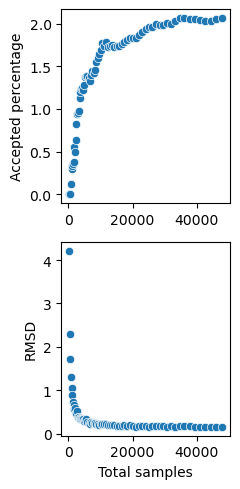
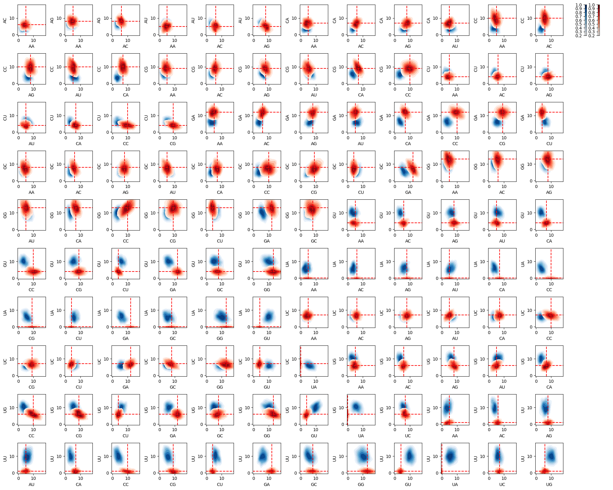

# Multi-dimensional Boltzmann sampling

------------------------------------------------------------

## Online resources and software environment

​

This document is hosted online as [Jupyter notebook](https://www.lix.polytechnique.fr/~will/Software/Infrared/current/Doc/MultiDimensionalBoltzmannSampling.ipynb) with precomputed results. Download this file to view, edit and run examples in Jupyter.

​

We recommend to install all required software using Mamba (or Conda) and PIP.

```

mamba create -n infrared -c conda-forge infrared jupyter jupytext matplotlib seaborn graphviz

mamba activate infrared

pip install graphviz

mamba deactivate infrared

```

​

Start the Jupyter notebook server after activating the environment

```

mamba activate infrared

jupyter notebook

```

The [original sources](https://gitlab.inria.fr/amibio/Infrared/-/tree/master/Doc/Examples) are part of the Infrared distribution and hosted on Gitlab (in Jupytext light Script format).

​

------------------------------------------------------------

## Targeting dinucleotide frequencies by MDBS
We demonstrate sampling of sequences targeting specific dinucleotide frequences and additional requirements; 
in this example, compatibility with an RNA target structure.

The targeting of dinucleotide frequencies is performed using the multi-dimensional Boltzmann sampling functionality of Infrared's Sampler (aka MultiDimensionalBoltzmannSampler) class.

## Import modules + define timing function


```python
import infrared as ir
import infrared.rna as rna
from collections import Counter
import random

import time
def report_time(f,desc=""):
    start=time.time()
    res=f()
    desc = "" if desc=="" else f' ({desc})'
    print(f'Time{desc}: {time.time()-start:0.2f}s')
    return res
```

## Preliminaries


```python
alphabet = "ACGU"
dimers = [ x+y for x in alphabet for y in alphabet ]
```

## Network function for dinucleotide counting

For use in the model, define counting of dinucleotide frequencies. The generated class will be constructed by the position $i$ (to count the dimer at positions $i$, $i+1$) and the respective dimer as string ("AA", "AC", ...).

Note how the dimer argument is passed from the first lambda function (`init'), which specified the construction and returns the dependency list [$i,i+1$] , to the second one (`value'), which evaluates the function given the values of variables $i$ and $i+1$.


```python
ir.def_function_class('DinuclFreq',
    lambda i,dimer: [i,i+1],
    lambda x,y,dimer: rna.values_to_seq([x,y])==dimer
)
```

## Input instance(s)


```python
#>CP000576.1:c381532-381475 Prochlorococcus marinus str. MIT 9301, complete genome
#UUUCGUUCACCCUCAUUUGAGGGCGCAGUUCGAGUCAUACCAUGGAACGGGGGAUGGC
seq0    = "UUUCGUUCACCCUCAUUUGAGGGCGCAGUUCGAGUCAUACCAUGGAACGGGGGAUGGC"
struct0 = "...[[[[[.(((((....)))))..........(((((.((...]]]]]))..)))))"

## Yann's example
seq = "CACUGUCGACUCAGUCAGUGAGUCGCGACUGACUGCAUCGCGACUACGUCAGUCGUACGAUCUAUUGUGCGAUAUCGCGCGAUAUAGCUAUGCG"
struct = None

# SAM (RF00162)
#>AP006840.1:c2688754-2688649 Symbiobacterium thermophilum IAM 14863 DNA, complete genome
#GGUUCAUCGAGAGUGGCGGAGGGACUGGCCCCAUGAUGCCACGGCAACCUCUCCCGCGGGGAGAACGGUGCCAAAUCCAGCGGACACUCGGUCCGAGAGAUGAAGC
seq    = "GGUUCAUCGAGAGUGGCGGAGGGACUGGCCCCAUGAUGCCACGGCAACCUCUCCCGCGGGGAGAACGGUGCCAAAUCCAGCGGACACUCGGUCCGAGAGAUGAAGC"
struct = "(.((((((....((((((..(((.[[[[.)))....))))))((((.((((((((...))))))..))))))....]]]](((((.....)))))...)))))).)"
print("Sequence length",len(seq))
```

    Sequence length 106


Obtain target frequencies from the sequence; print the counts


```python
tgtfreqs = Counter(seq[i]+seq[i+1] for i in range(len(seq)-1))
print(tgtfreqs)
```

    Counter({'GG': 13, 'GA': 12, 'CC': 10, 'CG': 9, 'AG': 8, 'GC': 8, 'UC': 7, 'CA': 7, 'UG': 6, 'AC': 6, 'AU': 5, 'AA': 5, 'GU': 4, 'CU': 4, 'UU': 1})


## Feature network model for the design task

## Generate model

The model consists of

* $n$ (sequence length) many variables, each with domains 0..3 (enconding the nucleotides);

* constraints to guarantee compatibility with the given structure;

* functions counting the different dinucleotides; defining one feature per dimer.


```python
n = len(seq)
model = ir.Model(n,4)

# complementarity constraints
if struct is not None:
    model.add_constraints(rna.BPComp(*bp) for bp in rna.parse(struct))

# dinucleotide frequency functions
for dimer in dimers:
    model.add_functions([DinuclFreq(i,dimer) for i in range(n-1)],dimer)
```

## Draw samples (without targeting)

This is mainly done, to check run-times for generating a number of samples (as is done by the multi-dimensional Boltzmann sampling strategy in every iteration). As well report the treewidth of the network (as determined by the sampler).


```python
nsamples=100
sampler = report_time(lambda:ir.Sampler(model,lazy=False),'Construction')
print("Treewidth:",sampler.treewidth())
_ = report_time(lambda:[rna.ass_to_seq(sampler.sample()) for _ in range(n)],'Sampling')
```

    Time (Construction): 0.76s
    Treewidth: 4
    Time (Sampling): 0.03s


## Draw targeted samples

Generate sampler, set parameters for the multi-dimensional Boltzmann sampling strategy and set the targets.


```python
sampler = ir.Sampler(model,lazy=True)
sampler.samples_per_round = 200
sampler.tweak_factor = 0.05

tolerance = 2

for dimer in dimers:
    sampler.set_target(tgtfreqs[dimer],tolerance=tolerance,featureid=dimer)
```


```python
## collect some statistics
def callback(total,accepted,fstats):
    rmsd = sampler.rmsd(fstats.means(),sampler.model.features)
    the_statistics.append({'samples':total, 'rmsd':rmsd, 'accepted':accepted})
    #print(fstats.report(),rmsd)
    
sampler.callback = callback
```

Actually, draw the targeted samples (and stop run time.)


```python
sampler.verbose = False

the_statistics = list()
the_samples = list() ## store the produced samples

print_samples = None

stats = ir.FeatureStatistics()
def draw_samples(n):
    for i in range(n):
        sample = sampler.targeted_sample()
        feature_values = {dimer:model.eval_feature(sample,dimer) for dimer in dimers}
        stats.record_features(model.features,feature_values)

        if print_samples:
            line = rna.ass_to_seq(sample)
            for dimer,freq in feature_values.items(): line += f" {dimer}:{freq}"
            if type(print_samples)!=int or (i+1)%print_samples==0: 
                print(i+1, line)
        the_samples.append(sample)
        
report_time(lambda:draw_samples(1000))
```

    Time: 309.44s


Finally, report some statistics and learned weights


```python
print("Targets",[f"{dimer}:{tgtfreqs[dimer]}" for dimer in dimers])
print("Stats  ",stats.report())
print("Weights",{k:f'{f.weight:.3f}' for k,f in sampler.model.features.items()})    
```

    Targets ['AA:5', 'AC:6', 'AG:8', 'AU:5', 'CA:7', 'CC:10', 'CG:9', 'CU:4', 'GA:12', 'GC:8', 'GG:13', 'GU:4', 'UA:0', 'UC:7', 'UG:6', 'UU:1']
    Stats   AA=4.82 +/-1.32 AC=5.92 +/-1.22 AG=8.19 +/-1.26 AU=5.08 +/-1.24 CA=7.03 +/-1.24 CC=10.03 +/-1.34 CG=9.11 +/-1.25 CU=4.15 +/-1.17 GA=11.88 +/-1.23 GC=7.77 +/-1.30 GG=12.94 +/-1.38 GU=3.88 +/-1.16 UA=0.35 +/-0.58 UC=6.86 +/-1.17 UG=5.90 +/-1.23 UU=1.11 +/-0.95
    Weights {'AA': '0.835', 'AC': '0.516', 'AG': '0.402', 'AU': '-0.121', 'CA': '0.777', 'CC': '0.419', 'CG': '-0.080', 'CU': '-0.936', 'GA': '1.560', 'GC': '0.522', 'GG': '0.414', 'GU': '-0.678', 'UA': '-1.588', 'UC': '0.097', 'UG': '-0.194', 'UU': '-1.943'}


## Plots sampling effectivity 


```python
import matplotlib.pyplot as plt
import seaborn as sns

fig, (ax1, ax2) = plt.subplots(2, 1, figsize=(2.5,5))

sns.scatterplot(x=[row['samples'] for row in the_statistics], y=[100*row['accepted']/row['samples'] for row in the_statistics],ax=ax1)
ax1.set_ylabel("Accepted percentage")
#sns.scatterplot(x=[row['samples'] for row in the_statistics], y=[row['accepted'] for row in the_statistics],ax=ax1)
#ax1.set_ylabel("Accepted samples")
sns.scatterplot(x=[row['samples'] for row in the_statistics], y=[row['rmsd'] for row in the_statistics],ax=ax2)
ax2.set_xlabel("Total samples")
ax2.set_ylabel("RMSD")
fig.tight_layout()
plt.savefig('mdbs_run.pdf')
plt.show()
```


    

    


## Distribution plots


```python
import math
def distribution_heatmaps(model,n,feature_list,fig,*,limits,labels=None,targets=None,ax=None,cmap="Blues"):
    sampler = ir.Sampler(model)
    samples = [sampler.sample() for _ in range(n)]
    
    def eval_features(sample):
        return {f:model.eval_feature(sample,f) for f in feature_list}
    
    features = [eval_features(sample) for sample in samples]

    if labels is None:
        labels = feature_list
    
    k = len(feature_list)
    
    the_plots = [(i,j) for i in range(1,k) for j in range(0,i)]
    nplots = len(the_plots)
    dimx = int(math.sqrt(nplots))
    dimy = nplots // dimx
    
    the_cells = [(i,j) for i in range(0,dimx) for j in range(0,dimy)]
    
    if ax is None:
        ax = fig.subplots(dimx,dimy+1,
                          squeeze=False,
                          width_ratios=[1]*dimy+[1]
                         )
            #sharex=True, sharey=True)
            
    for x in range(dimx):
        for y in range(dimy+1):
            if (x,y) not in the_cells[:nplots]:
                ax[x][y].axis("off")

    for idx,(i,j) in enumerate(the_plots):

        fi = feature_list[i]
        fj = feature_list[j]
        
        cax = ax[the_cells[idx][0]][the_cells[idx][1]]
        
        sns.kdeplot(x=[f[fj] for f in features],y=[f[fi] for f in features], ax = cax,
                cmap=cmap, levels=8, thresh=0.2, cbar = False, fill=True)
        if targets:
            cax.axhline(y = targets[fi], color = 'red', linestyle = 'dashed')
            cax.axvline(x = targets[fj], color = 'red', linestyle = 'dashed')

        cax.set_ylabel(labels[i])
        cax.set_xlabel(labels[j])

        cax.set_ylim(limits[i])
        cax.set_xlim(limits[j])

    plt.colorbar(plt.cm.ScalarMappable(cmap=cmap),ax=ax[0][dimy],
        pad=0.4,
        location="left",
        boundaries=[0.2+i/10 for i in range(9)],
        values=[i/8 for i in range(1,9)])
    
    return ax
```


```python
sel_dimers = dimers #["CC","GU", "GG", "UU"]

limits=[(-0.5,18)]*len(sel_dimers)

n = 500

k=len(sel_dimers)

#fig = plt.figure(figsize=(10,5))
fig = plt.figure(figsize=(20,16))

ax = distribution_heatmaps(model,n,sel_dimers,fig,limits=limits,cmap="Blues")
distribution_heatmaps(sampler.model,n,sel_dimers,fig,limits=limits,
                      targets=tgtfreqs,
                      ax=ax,cmap="Reds")
fig.tight_layout()
plt.savefig('mdbs_heatmaps.pdf')
plt.show()
```


    

    

