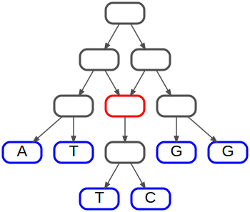
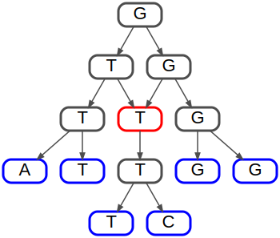
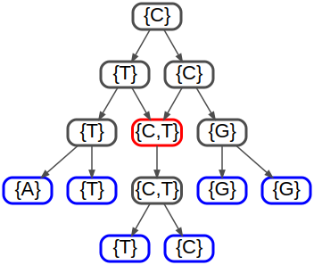
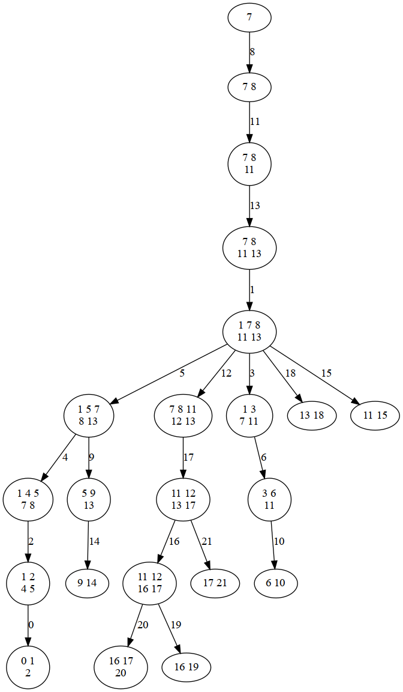

# Network parsimony

------------------------------------------------------------

## Online resources and software environment

​

This document is hosted online as [Jupyter notebook](https://www.lix.polytechnique.fr/~will/Software/Infrared/current/Doc/NetworkParsimony.ipynb) with precomputed results. Download this file to view, edit and run examples in Jupyter.

​

We recommend to install all required software using Mamba (or Conda) and PIP.

```

mamba create -n infrared -c conda-forge infrared jupyter jupytext matplotlib seaborn graphviz

mamba activate infrared

pip install graphviz

mamba deactivate infrared

```

​

Start the Jupyter notebook server after activating the environment

```

mamba activate infrared

jupyter notebook

```

The [original sources](https://gitlab.inria.fr/amibio/Infrared/-/tree/master/Doc/Examples) are part of the Infrared distribution and hosted on Gitlab (in Jupytext light Script format).

​

------------------------------------------------------------

## The problem(s) of network parsimony

The small parsimony problem is typically defined over phylogenetic trees. First assuming that traits are inherited independently of each other, we consider the problem for a single trait with possible characters in set $C$. The input of the small tree parsimony problem
is a tree and a labeling of the leaves by characters in $C$. The 
problem asks for a labeling of all tree nodes that minimizes the number of label differences ("mutations") over all tree edges.

Network parsimony generalizes the notion of parsimony from trees to networks.

We consider three types of small network parsimony problems the literature:

* hardwired parsimony
* softwired parsimony
* parental parsimony

In all of these problems one is given a rooted network, i.e. a finite directed acyclic graph (DAG) $G=(V,E)$ with one distinct root node $v_r$ together with a labeling of the leaves (or generally a partial labeling $\phi: V\rightarrow 2^C$. The task is to find a labeling of the nodes that minimizes a specific parsimony criterion.

In our considerations we follow the popular restriction to networks with indegree of at most two.

## Hardwired parsimony

Given a rooted network and partial node labeling, one minimizes the number of mutations over all directed edges of the network, i.e.

$PS_{hardwired} = \min_\psi \sum_{(u,v)\in E} \psi(u)\neq\psi(v)$

where $\psi: V\rightarrow C$ s.t. $\forall v\in V: \psi(v)\in\phi(v)$.

This is a formal extension of tree parsimony to networks; one accounts for mutations along all edges.

## Softwired parsimony

Given a rooted network and partial node labeling, one minimizes the number of mutations over all directed edges of a directed spanning tree of the network (which effectively selects a single parent for every reticulation node), i.e.

$PS_{softwired} = \min_{\psi, T} \sum_{(u,v)\in E_T} \psi(u)\neq\psi(v),$

where $\psi: V\rightarrow C$ s.t. $\forall v\in V: \psi(v)\in\phi(v)$.

The idea of this model is that the network specifies the set of potential phylogenetic trees over which one solves the small tree parsimony problem.

## Parental parsimony

This model considers the inheritance of allels in a polyploid setting. Characters can be mutated in children and/or collected from the ancestors (by allopoloploidy). (We present the problem from the lineage perspective!)
Consequently, nodes are labeled by sets of characters.

$PS_{parental} = \min_{f} \sum_{v\in V} \textrm{cost}_f(v),$

where
 * $f: V\rightarrow 2^C$
 * $f(v_r) = 1$
 * $|f(v)| \leq \sum_{u\text{ parent of }v} |f(u)|$ 
 * $\textrm{cost}_f(v) = |f(v) \setminus 
     \bigcup_{u\textrm{ parent of }v} f(u)|$


```python
import infrared as ir
from collections import defaultdict
import random
```


```python
class DAG:
    """A simple class reprenting a rooted DAG
    """
    
    def __init__(self, adjacency):
        adjacency = {k:(v if type(v)==list else [v]) for k,v in adjacency.items()}
    
        nodes = set(adjacency.keys())
        edges = []
        for x in adjacency:
            nodes.update(adjacency[x])
            edges.extend((x,y) for y in adjacency[x])
            
        self._nodes = nodes
        self._edges = edges
        
        # precompute parents, children, root
        # and perform some checks for 'proper' DAG
        self._parents=defaultdict(list)
        for u,v in self._edges:
            self._parents[v].append(u)
    
        self._children=defaultdict(list)
        for u,v in self._edges:
            self._children[u].append(v)
    
        # find root
        self._root = None
        for v in self.nodes:
            if self.parents(v)==[]:
                assert(self._root==None)
                self._root = v
        assert(self._root!=None)

    
        assert(self._parents[self._root]==[])
        for node in self._nodes:
            if node==self._root: continue
            assert(self._parents[node]!=[])
    
    
    def parents(self, node):
        return self._parents[node]
    
    def children(self, node):
        return self._children[node]
        
    @property
    def root(self):
        return self._root
        
    @property
    def edges(self):
        return self._edges

    @property
    def nodes(self):
        return self._nodes

    @property
    def reticulation_nodes(self):
        return [v for v in self._nodes if len(self.parents(v))>1]
    
    @property
    def nonreticulation_nodes(self):
        return [v for v in self._nodes if len(self.parents(v))==1]

    @property
    def leaves(self):
        return [v for v in self._nodes if self.children(v)==[]]
    
    def show(self, labels=None, shownames=False):
        import graphviz
        
        G=graphviz.Digraph(engine="dot",
            graph_attr=dict(),
            node_attr=dict(fontsize="22pt", fontname="Helvetica",
                           penwidth="3.0", fontcolor="black",
                           shape="rectangle", style="rounded",
                           height="0.4", margin="0.03"),
            edge_attr=dict(color="gray30", penwidth="1.5", arrowsize="0.8"))
        
        for v in self.nodes:
            try:
                label = labels[v]
                assert(label!=None)
            except:
                label = ""
            if type(label)==set:
                label='{'+','.join(sorted(map(str,label)))+'}'
            if shownames:
                label = f"{v}:{label}"
                
            color = "gray30"
            if len(self._parents[v])>1: color="red"
            if len(self._children[v])==0: color="blue"
        
            G.node(str(v), label=str(label), color=color)
        for v,u in self.edges:
            G.edge(str(v),str(u))
        return G
    
    def print(self, labels):
        for v in self.nodes:
            print(f'{v}\'{labels[v]}\' -> {self.children(v)}')
```

## An example input instance


```python
characters = ["A","C","G","T"]
def a_to_cs(assignment):
    """Assignement to characters"""
    return [characters[x] for x in assignment.values()]

## note: for building the model from our graph definition, we require that nodes are consecutive integers 0,1,2,3...

network = DAG({0:[1,2], 1:[3,4], 2:[4,5], 4:6, 3:[7,8], 6:[9,10], 5:[11,12]})

leaves = ['A','T','T','C','G','G']
leaves = {k:v for k,v in zip(network.leaves,leaves)}
```


```python
dot = network.show(leaves)
dot.render('input-network')
dot
```


    

    


## Model hardwired parsimony

### Define a hamming distance function between nodes 


```python
ir.def_function_class("Distance",
    lambda u,v: [u,v],
    lambda psi_u,psi_v: psi_u != psi_v
    )
```

### Construct the model


```python
model = ir.Model()

model.add_variables(len(network.nodes), len(characters))
model.add_functions([Distance(u,v) for u,v in network.edges],
                   'score')

model.set_feature_weight(-1, 'score') # -1, since we are minimizing

# constrain leaves
for k,v in leaves.items():
    val = characters.index(v)
    model.restrict_domains(k, (val,val))
```

### Run optimization


```python
optimizer = ir.Optimizer(model)

best_score = -optimizer.evaluate()
best = optimizer.optimize()

print(f'Score: {best_score}')

dot = network.show(a_to_cs(best))
dot.render("hardwired-network",view=False)
dot
```

    Score: 3.0


    

    


## Model softwired parsimony with additional state (effectively keeps tree width!)

### Define hamming distance for reticualtions


```python
ir.def_function_class("ReticulationDistance",
    lambda u,v,x,y: [u, v, x],  # u is the parent!, x is the selector variable, boolean y distinguishs between parents
    lambda psi_u, psi_v, valx, y: (psi_u != psi_v) and valx==y
    )
```

### Construct model


```python
model = ir.Model()

n=len(network.nodes)

model.add_variables(n, len(characters))
model.add_functions([Distance(network.parents(v)[0],v)
                     for v in network.nonreticulation_nodes],
                    'score')

r = len(network.reticulation_nodes)
# add boolean selector variables (one for each reticulation nodes); indices n+1,...,n+r
model.add_variables(r,2)


for parent in range(2):
    model.add_functions([ReticulationDistance(network.parents(v)[parent],v,n+i,parent)
                         for i,v in enumerate(network.reticulation_nodes)],
                        'score')


model.set_feature_weight(-1, 'score')

# constrain leaves
for k,v in leaves.items():
    val = characters.index(v)
    model.restrict_domains(k, (val,val))
```

### Run optimization


```python
## attention: currently, the default tree demposer of infrared might not yield the optimal result, since we added
## state variables. Here, we refrain from correcting this to keep things simple. Future versions of Infrared
## should address this properly.

optimizer = ir.Optimizer(model)

best_score = -optimizer.evaluate()
best = optimizer.optimize()

print(f'Score: {best_score}')

dot = network.show(a_to_cs(best))
dot.render("softwired-network",view=False)
dot
```

    Score: 3.0


    

    


## Model softwired parsimony with ternary constraint

### Define hamming distance for reticualtions


```python
ir.def_function_class("ReticulationDistance",
    lambda u0,u1,v: [u0, u1, v],
    lambda psi_u0,psi_u1,psi_v: min(psi_u0 != psi_v,psi_u1 != psi_v)
    )
```

### Construct model


```python
model = ir.Model()

model.add_variables(len(network.nodes), len(characters))
model.add_functions([Distance(network.parents(v)[0],v)
                     for v in network.nonreticulation_nodes],
                    'score')

model.add_functions([ReticulationDistance(network.parents(v)[0],network.parents(v)[1],v)
                     for v in network.reticulation_nodes],
                    'score')

model.set_feature_weight(-1, 'score')

# constrain leaves
for k,v in leaves.items():
    val = characters.index(v)
    model.restrict_domains(k, (val,val))

```

### Run optimization


```python
optimizer = ir.Optimizer(model)

best_score = -optimizer.evaluate()
best = optimizer.optimize()

print(f'Score: {best_score}')
network.show(a_to_cs(best))
```

    Score: 3.0


    

    


## Model parental parsimony

### Model character sets as integer values


```python
def cs2v(cset):
    val=0
    for i,c in enumerate(characters):
        if c in cset:
            val += 2**i
    return val
    
def v2cs(val):
    x=set()
    for c in characters:
        if val & 1:
            x.add(c)
        val = val >> 1
    return x

def a_to_csets(assignment):
    """Assignment to characters sets"""
    return [v2cs(val) for val in assignment.values()]
```

### Define distances on set labels


```python
ir.def_function_class("SetDistance",
    lambda u,v: [u, v],
    lambda f_u, f_v: len(v2cs(f_v)-v2cs(f_u)))
ir.def_function_class("ReticulationSetDistance",
    lambda u0, u1, v: [u0, u1, v],
    lambda f_u0, f_u1, f_v: len(v2cs(f_v)-v2cs(f_u0).union(v2cs(f_u1))))
```

### Define constraint types


```python
ir.def_constraint_class('SetSize',
    lambda v,size: [v],
    lambda f_v, size: len(v2cs(f_v))==size)

ir.def_constraint_class('SetSizeRel',
    lambda u,v: [u, v],
    lambda f_u, f_v: len(v2cs(f_v)) <= len(v2cs(f_u)))

ir.def_constraint_class('ReticulationSetSizeRel',
    lambda u0, u1, v: [u0, u1, v],
    lambda f_u0, f_u1, f_v: len(v2cs(f_v)) <= len(v2cs(f_u0).union(v2cs(f_u1))))
```

### Construct model


```python
model = ir.Model()

model.add_variables(len(network.nodes), 2**len(characters))

model.add_constraints(SetSize(network.root,1))

model.add_constraints(SetSizeRel(network.parents(v)[0],v)
    for v in network.nonreticulation_nodes)

model.add_constraints(ReticulationSetSizeRel(network.parents(v)[0],network.parents(v)[1],v)
    for v in network.reticulation_nodes)

model.add_functions([SetDistance(network.parents(v)[0],v)
                     for v in network.nonreticulation_nodes],
                    'score')

model.add_functions([ReticulationSetDistance(network.parents(v)[0],network.parents(v)[1],v)
                     for v in network.reticulation_nodes],
                    'score')

model.set_feature_weight(-1, 'score')

# constrain leaves
for k,v in leaves.items():
    val = cs2v(v)
    model.restrict_domains(k, (val,val))

```

### Run optimization


```python
optimizer = ir.Optimizer(model)

best = optimizer.optimize()
best_score = -optimizer.evaluate()

print(f'Score: {best_score}')
dot = network.show(a_to_csets(best))
dot.render("parental-network",view=False)
dot
```

    Score: 3.0


    

    


# APPENDIX

## Grid networks

Construct grid networks as a simple family of networks that allow us to enforce high tree width for decomposition.


```python
def grid(n):
    adj = defaultdict(list)
    offset=0
    for i in range(n-1):
        for j in range(offset,offset+i+1):
            adj[j]=[j+i+1,j+i+2]
        offset+=i+1

    offset0 = offset #first 'parent' in last row 
    offset+=n # first node in constructed row
    for i in reversed(range(n-1)):
        adj[offset0].append(offset)
        for j in range(1,i+2):
            adj[offset0+j-1].append(offset+j)
            adj[offset0+j].append(offset+j)
        adj[offset0+i+1].append(offset+i+2)
        offset0 = offset+1
        offset+=i+3
    
    return adj
```


```python
network=DAG(grid(4))
leaves = {k:random.choice(characters) for k in network.leaves}
network.show(leaves,shownames=True)
```


    

    


```python
#construct and solve a hardwired model
model = ir.Model()

model.add_variables(len(network.nodes), len(characters))
model.add_functions([Distance(u,v) for u,v in network.edges],
                   'score')

model.set_feature_weight(-1, 'score') # -1, since we are minimizing

for k,v in leaves.items():
    val = characters.index(v)
    model.restrict_domains(k, (val,val))


# Run optimization

optimizer = ir.Optimizer(model)

print("TW:",optimizer.treewidth())

best_score = -optimizer.evaluate()
best = optimizer.optimize()

print(f'Score: {best_score}')
```

    TW: 4
    Score: 5.0


```python
from IPython.display import Image
import re
```


```python
# Plot dependency graph
filename = 'dependency_graph.dot'
model.write_graph(filename, True)

ir.dotfile_to_png(filename)
filename = re.sub(r"dot$","png",filename)

Image(filename=filename,width=300)
```


    

    


```python
# Plot tree decomposition
filename="treedecomp"
optimizer.plot_td(filename,'png')
Image(filename=filename+".png",width=400)
```


    

    


```python
network.show(a_to_cs(best))
```


    

    


```python

```
